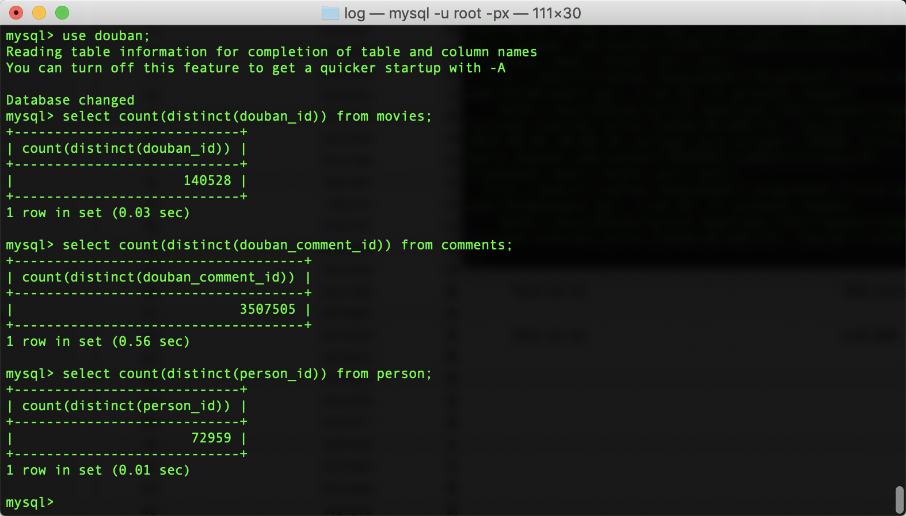

# 370万+豆瓣影评数据爬取说明

## 介绍

本项目是针对豆瓣电影、名人、书籍、评论于一体的爬虫项目，关于爬虫的代码细节，笔者正在整理中，还请读者见谅。爬虫框架说明和爬虫数据分析介绍可参考笔者下面的文章。本项目配置代理之后，将并发数上调，在Mac单机上面，不用一晚上就可以爬取300万的影评数据（电影+演员+评论），如果没有代理，就另当别论啦。代理其实网上有免费的，但是不太好用，笔者花了几十块从代理商买了一周，足够用了。这里就不专门给代理商打广告了，如读者需要我推荐相关代理，可在关注笔者的公众号，在公众号留言即可，笔者每天都会回复的。


1. [13万豆瓣电影数据爬取原理剖析](http://www.csuldw.com/2019/08/29/2019-08-29-douban-spider/)
2. [350万豆瓣电影评论数据爬取](http://www.csuldw.com/2019/09/05/2019-09-05-douban-comment-stat/)
3. [豆瓣13万电影数据统计与分析](http://www.csuldw.com/2019/08/12/2019-08-12-douban-movies-statistics/)


## 数据爬取流程说明


首先爬取电影/书籍的subject_id，即douban_id，然后通过douban_id爬取电影/书籍相关评论信息。由于在爬取电影数据的时候，我们将演员和ID保存在了数据库里面，因此在爬取演员信息的时候，需要将演员的ID和姓名从电影数据库中抽取出来。也就是说，我们爬取演员信息的时候，也是通过演员的ID进行爬取的。

## 使用方法


1.clone 代码

```
git clone https://github.com/csuldw/AntSpider.git
```

2.安装MySQL

将`scrapy/sql/douban.sql`里面的相关表创建好，然后配置好`douban/database.py`文件的数据源用户名和密码。

3.安装python依赖库

```
cd AntSpider
pip install -r requirements.txt 
```

4.爬取movie信息

**温馨提示：爬取数据之前，请进入scrapy目录，查看相关说明，并修改scrapy/douban目录下的`setting.py`文件。**

由于笔者添加了代理池，每次的代理都是从数据库中获取，而数据库的代理会定时更新，如果没有代理数据的，setting.py文件中DOWNLOADER_MIDDLEWARES的proxy注释掉，同时将`CONCURRENT_REQUESTS`注释掉，避免本地的IP被禁。

```
DOWNLOADER_MIDDLEWARES = {
    #'douban.middlewares.ProxyMiddleware': 400,
    'douban.middlewares.RandomUserAgentMiddleware':543,
    'scrapy.downloadermiddlewares.useragent.UserAgentMiddleware': None,
    'scrapy.spidermiddlewares.depth.DepthMiddleware': 900,
}
```

然后就可以开始进行电影数据爬取了，命令如下：

```
# 进入 scrapy 目录
cd scrapy
#查看爬虫list
scrapy list
#爬取subject，首先爬取电影的douban_id
scrapy crawl movie_subject
#根据douban_id爬取meta信息
scrapy crawl movie_meta
```

5.爬取评论信息

```
#根据douban_id爬取评论信息
scrapy crawl movie_comment
```

6.爬取演员信息

```
#将movie中的演员名和演员ID抽取出来，存放到person_obj表
python3 scrapy/douban/rebuild_pid.py
scrapy crawl person_item
```

7.爬取书籍信息（附加）

```
# 抓取书籍数据
# 收集书籍 Subject ID
scrapy crawl book_subject 
# 收集书籍元数据
scrapy crawl book_meta 
# 收集书籍评论
scrapy crawl book_comment 
```



## 后记

大家如果有什么疑问，可关注笔者的公众号，有事我们微信上聊！


## 联系作者


